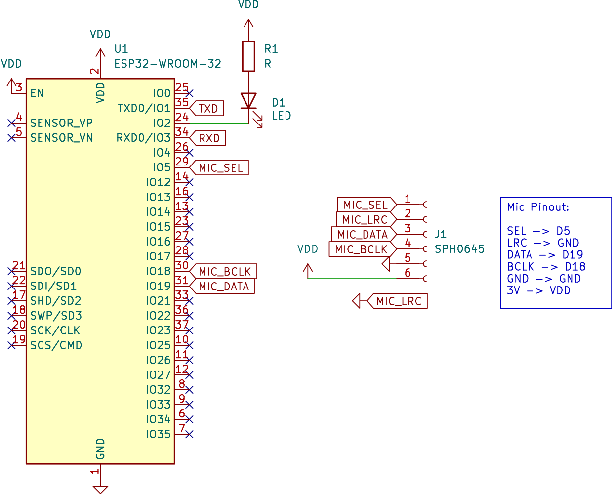

# ESP32-based Sound Input Testing

## Contents

This folder contains:

- [Circuit](#circuit)
- [ESP IDF](#idf)
- [PlatformIO](#platformio)

## Circuit

Circuit folder only contains schematic without layout.



Its designed using KiCAD 7 on Arch Linux without additional libraries.

## IDF

This source tree based on XTensa's GCC for ESP32, ESP-IDF, and ESP-DSP.
Information described here on works only for Arch-Linux or its derivative.

### Device Access

Run these command to gain device access without sudo:

```sh
sudo groupadd -fr lock
sudo groupadd -fr uucp

sudo gpasswd -a $USER lock
sudo gpasswd -a $USER uucp
```

Then reboot.

### Setup

Install following Arch Linux Packages:

- Python 3.9: [AUR](https://aur.archlinux.org/packages/python39/)
- XTensa GCC (remove all python2-*): [AUR](https://aur.archlinux.org/packages/xtensa-esp32-elf-gcc-bin/)
- ESP-IDF: [PKGBUILD](https://github.com/mekatronik-achmadi/archmate/tree/main/pkgbuilds/optional/esp32-idf/)
- ESP-DSP: [PKGBUILD](https://github.com/mekatronik-achmadi/archmate/tree/main/pkgbuilds/optional/esp32-dsp/)

Then setup Python environment:

```sh
cd $HOME
virtualenv --python=/usr/bin/python3.9 esp-python --system-site-packages

source $HOME/esp-python/bin/activate
pip install kconfiglib future cryptography pyserial pyparsing==2.2.0
deactivate

cd -
```

run these command script to use virtual environment

```sh
source esp32env.sh
```

### Build

#### generate compile commands for clangd

**NOTES:** You just need to do this once

```sh
make defconfig
bear -- make app
```

## PlatformIO