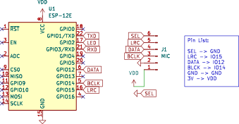

# ESP266-based Sound Input Testing

## Acknowledge

This work are based on:
- [I2S Documentation](https://docs.espressif.com/projects/esp8266-rtos-sdk/en/latest/api-reference/peripherals/i2s.html)
- [Adafruit Guide](https://learn.adafruit.com/adafruit-i2s-mems-microphone-breakout)

## Contents

This folder contains:

- [Circuit](#circuit)
- [ESP RTOS](#rtos)
- [PlatformIO](#platformio)

## Circuit

Circuit folder only contains schematic without layout.



Its designed using KiCAD 7 on Arch Linux without additional libraries.

## RTOS

This source tree based on XTensa's GCC for ESP8266, and ESP-RTOS.
Information described here on works only for Arch-Linux or its derivative.

### Device Access

Run these command to gain device access without sudo:

```sh
sudo groupadd -fr lock
sudo groupadd -fr uucp

sudo gpasswd -a $USER lock
sudo gpasswd -a $USER uucp
```

Then reboot.

### Setup

Install following Arch Linux Packages:

- Python 3.9: [AUR](https://aur.archlinux.org/packages/python39/)
- XTensa GCC : [AUR](https://aur.archlinux.org/packages/xtensa-lx106-elf-gcc-bin/)
- ESP-RTOS: [PKGBUILD](https://github.com/mekatronik-achmadi/archmate/tree/main/pkgbuilds/optional/esp8266-rtos/)

Then setup Python environment:

```sh
cd $HOME
virtualenv --python=/usr/bin/python3.9 esp-python --system-site-packages

source $HOME/esp-python/bin/activate
pip install kconfiglib future cryptography pyserial pyparsing==2.2.0
deactivate

cd -
```

run these command script to use virtual environment

```sh
source esp8266env.sh
```

### Build

#### generate default sdkconfig

**NOTES:** You just need to do this once to generate **sdkconfig** file.

```sh
make defconfig
```

#### generate compile commands for clangd

**NOTES:** You just need to do this once

```sh
bear -- make app
```

#### reflash bootloader and partition table

**NOTES:** You just need to do this once each development kit.
But you should repeat this step after flashing firmware using Arduino or PlatformIO.

Connect USB and run commands:

```sh
make erase_flash
make bootloader-flash
make partition_table-flash
```

#### compile app and flashing

compile command:

```sh
make app
```

if successfully compiled, flash to chip using command:

```sh
make app-flash
```

## PlatformIO